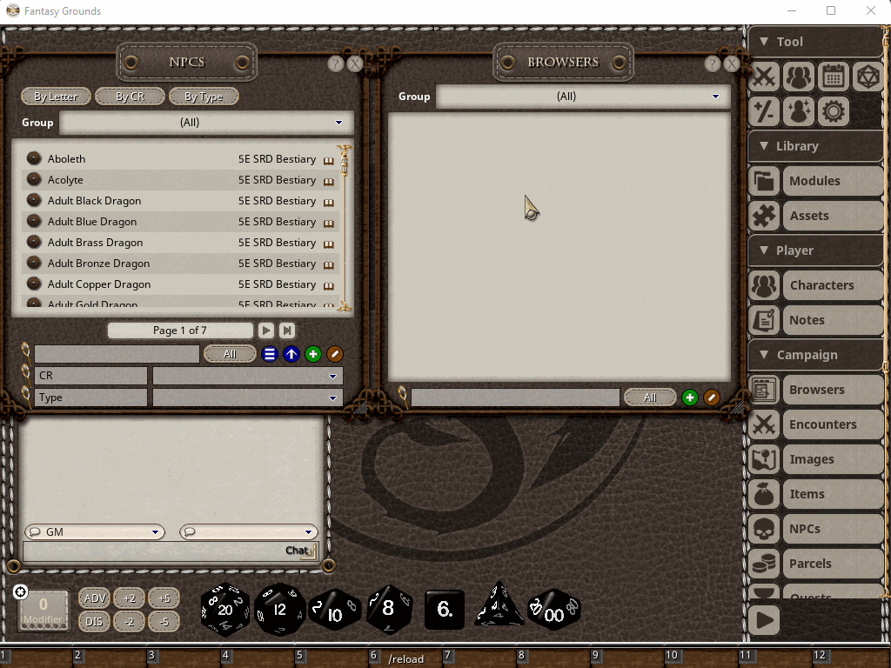
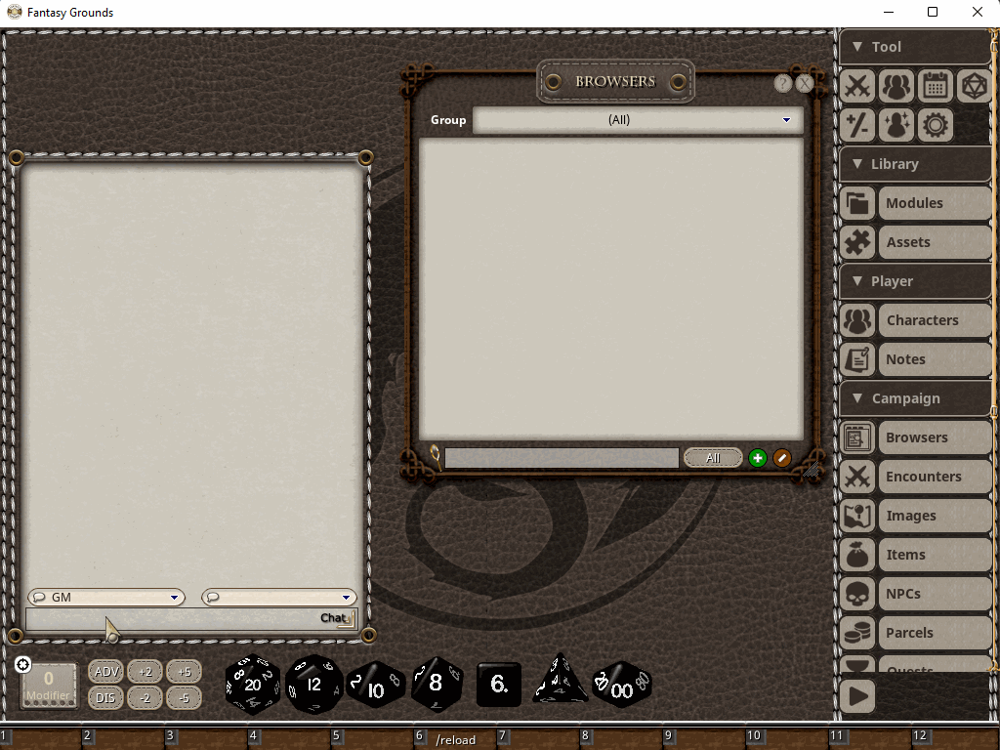
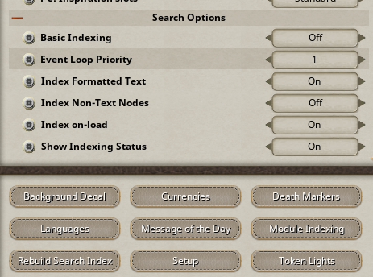

## FG Browser

This is an extension for Fantasy Grounds Unity that adds a browser-style functionality for the purposes of organizing 
and searching records and reference library data. 

I made it for my own purposes as I was having a hard time managing all of the campaign records in a long-running game 
with a lot of recurring NPCs and other campaign records. 

I also wanted a search feature to be able to perform full-text search of all records and library data in a single place, 
because I would often forget where something was and wanted an easier way to find NPCs based on data in their notes, 
find story records based on their content, or search the library reference data.

The example screenshots below are taken from the 5e ruleset just because that is a very popular game system, 
but the extension should work with pretty much any ruleset based on CoreRPG. I myself use it in my own homebrew ruleset.

## Installation 
Download FGBrowser.ext and place in the Extensions directory of your Fantasy Grounds data folder, or just use the Forge.
I will update here with the forge link when it is approved on the Forge.

## Usage

It can be used in 2 ways, as a campaign record type, or as dynamic browser windows that will not be stored permanently.

To create a persisted browser type campaign record, it is available under the "Browsers" campaign record type on the sidebar. 
You can create a blank browser and add records either by drag/dropping them into the tab list, or by using the search page 
to look up records. Here is an example:

When using the search page, you can use the filter field at the bottom to filter the results by record class. You can either 
left-click on search results to open them in a new tab and immediately switch to the tab, or middle-click to open them in 
a new tab without switching to it (like most web browsers). Tabs can be closed via the middle mouse button.

Tabs can also be renamed either by double-clicking the tab, or right-clicking and using the edit option in the radial menu.

You can also use the browser without linking it to a campaign record. To do so, just use the chat command:

/foogle &lt;search string&gt;

The optional search string parameter, if provided, will perform a search automatically when opened.

If you have a dynamic browser window that you want to persist to the campaign data, you can right-click and there is a 
save option in the radial menu which will copy the dynamic browser to a persisted one. Here is an example of a dynamic 
browser:

## Search Options

The search feature depends on a search indexer that runs in the background and builds an index of campaign and module 
records in order to serve search results quickly. The problem is that FG doesn't have any way to execute code in the background.

In order to make the search indexing work adequately across a variety of environments, the search indexing has many 
config options that impact its performance. For simplicity, there is a console command to set the search options to one 
of five preset levels based on your preferences:

> /indexMode <min|low|normal|high|max>

The "min" setting will disable indexing on-load and only index on-demand. I would recommend using that if you just want 
to use the browser for organizing records in tabs and don't want to use the search.

The other four settings (low, normal, high, max) are based on the performance of your PC. The main limiting factor seems 
to be disk speed. On an NVMe drive, high or max seem to work fine. The slower the read performance of the drive, the 
more you will notice impacts to the usability of the interface from the indexer.

If you want to tweak the settings manually, these are the available options:

* Basic Indexing
    * Turning on Basic Indexing will restrict the indexer to simple string fields only, which speeds up indexing
    * It will also use a basic whitespace-only tokenizer instead of the normal tokenizer that handles common work pre/suffixes
* Event Loop Priority
    * This controls how much priority the indexer event loop will be given
    * Higher settings will result in more work being done by each event loop iteration before returning control to the FG client
    * The "Blocking" setting will tell the event loop to just run continuously without returning control to FG until it is done. It locks up the UI entirely while indexing, but it will run fastest in this mode, if that is what you want.
* Index Formatted Text
    * Controls whether to index formattedtext database fields
* Index Non-Text Nodes
    * Controls whether to index non-text database fields, like image names, dice, links, etc. 
* Index on-load
    * Controls whether to run the indexer automatically at startup. 
    * When disabled, the indexer will not run unless you manually click "Rebuild Search Index"
    * Disables search functionality altogether until you manually run the indexer
* Show Indexing Status
    * When enabled, active indexing jobs will be shown in a small, transparent window in the top right.

In addition to the general settings, the Module Indexing window can also be used to toggle indexing for loaded modules. 
Modules that are not selected here will not be indexed, and their contents will not be visible in search results.